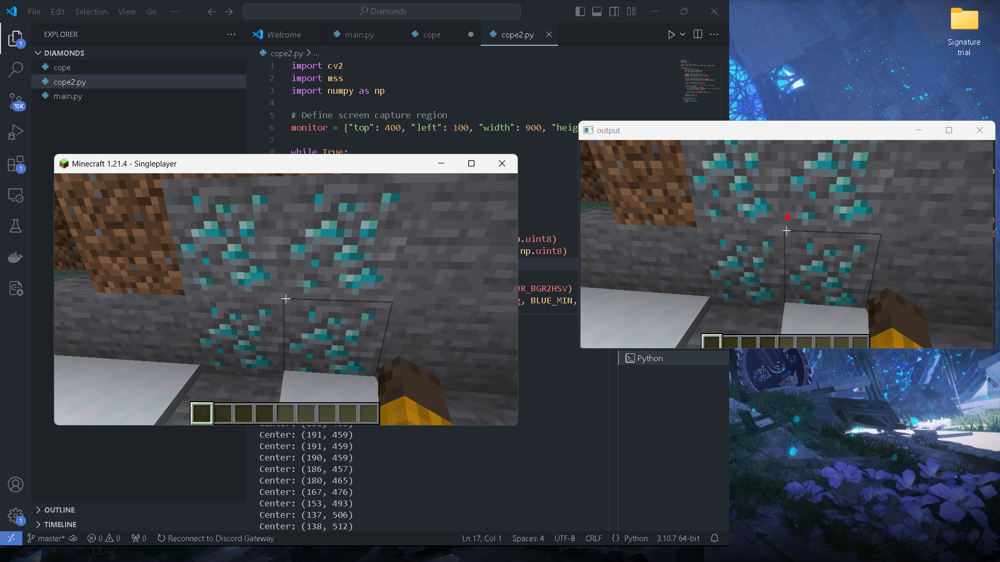

# Minecraft Diamonds Locator
This project utilizes OpenCV to identify diamond-like objects in Minecraft by isolating specific colors and patterns through HSV masking. The game screen is captured in real-time, and no game memory lookup is used, mimicking how a real player would navigate the game. The program processes live game frames and highlights detected areas with visual markers (e.g., red dots), helping players easily locate diamonds during gameplay.

# Features:
* Real-time screen capture and processing
* Color and pattern isolation using OpenCV's HSV thresholding
* Visualization of detected diamond-like objects by marking their centers with red dots
* Does not rely on memory hacking or coordinates; fully player-centric approach
  
# Technologies:
* Python
* OpenCV: For image processing and color detection
* mss: For screen capturing in real-time
* NumPy: For efficient matrix operations
* 

